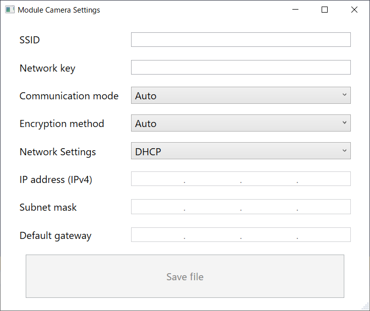

# Module Camera Settings (mcs.exe)

"__Wireless network connection setting file__" creation tool for i-PRO module camera.
This tool is an application for Microsoft Windows programmed using the .NET Framework and C#.

i-PRO モジュールカメラのための "__無線接続設定ファイル__" を作成するツールです。
.NET Framework と C# を使って作成された Microsoft Windows 用のアプリケーションです。

---

## Summary

- "Module Camera Settings" is a tool to create a "__wireless network connection setting file__" for i-PRO module cameras.
- "__Wireless network connection setting file__" is a file used for wireless connection settings of i-PRO module cameras.

## How to use "Module Camera Settings" tool

1. Launch the "Module Camera Settings" tool (mcs.exe).
1. Enter the information required for wireless connection on the tool screen.
1. Click the [Save file] button to save the "wireless network connection setting file".  
__IMPORTANT__: You MUST save the filename as "MCS-INIT".　※Do not modify the MCS-INIT file.
1. Save the "wireless network connection setting file(MCS-INIT)" to the microSD.  
__IMPORTANT__: You MUST save to the root of the microSD.
1. Insert the microSD into the i-PRO camera body.
1. Turn on the power of the i-PRO camera. Automatically configure wireless settings for i-PRO cameras.
1. Setting completed.

## The way to build "Module Camera Settings" tool

You can build the source code using Visual Studio 2019/2022 or by following the steps below.

1. Download and install the latest version of .NET SDK corresponding to architecture.  
[Download .NET 7.0 (Linux, macOS, and Windows) (microsoft.com)
](https://dotnet.microsoft.com/en-us/download/dotnet/7.0)

2. Launch PowerShell, and execute the command "dotnet build -c Release" in the folder for saved "ModuleCameraSettings.sln".

---

## 概要

- "Module Camera Settings" は i-PRO モジュールカメラのための "__無線接続設定ファイル__" を作成するツールです。
- "__無線接続設定ファイル__" は i-PRO モジュールカメラの無線接続設定に使用するファイルです。

## "Module Camera Settings" ツールの使用方法

1. "Module Camera Settings" ツール (mcs.exe) を起動します。
1. ツール画面上に無線接続に必要な情報を入力します。
1. [Save file] ボタンをクリックすることで "無線接続設定ファイル" を保存します。  
__重要__: 必ずファイル名を "MCS-INIT" として保存してください。　※MCS-INITファイルは、変更しないでください。
1. "無線接続設定ファイル(MCS-INIT)" を microSD カードに保存します。  
__重要__: 必ず microSD カードのルートに保存してください。
1. microSD カードを i-PRO カメラへ挿入します。
1. i-PRO カメラの電源を On にします。i-PRO カメラの無線設定を自動的に行います。
1. 設定を完了です。

## "Module Camera Settings" ツールのビルド手順

Visual Studio 2019/2022 または 下記手順により、ソースコードをビルドすることができます。

1. 最新版の .NET SDK をダウンロードしてインストールします。  
[Download .NET 7.0 (Linux, macOS, and Windows) (microsoft.com)
](https://dotnet.microsoft.com/en-us/download/dotnet/7.0)

2. PowerShell を起動し、"ModuleCameraSettings.sln" ファイルを保存するフォルダーで "dotnet build -c Release" コマンドを実行します。

